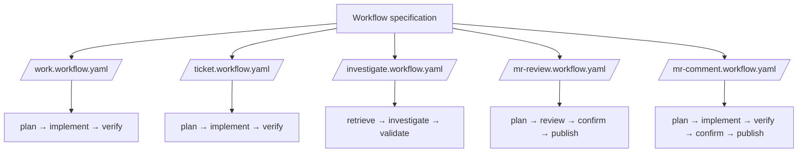
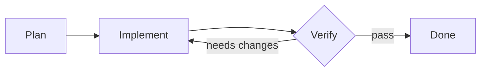

# Local workflow specification

This directory defines the local workflow specification in `agent/workflows/`.
The YAML specifications compose stage prompts in `agent/workflows/steps/`.

```mermaid
flowchart TD
    S[Workflow specification] --> W[/work.workflow.yaml/]
    S --> T[/ticket.workflow.yaml/]
    S --> I[/investigate.workflow.yaml/]
    S --> R[/mr-review.workflow.yaml/]
    S --> C[/mr-comment.workflow.yaml/]

    W --> WP[plan → implement → verify]
    T --> TP[plan → implement → verify]
    I --> IP[retrieve → investigate → validate]
    R --> RP[plan → review → confirm → publish]
    C --> CP[plan → implement → verify → confirm → publish]
```

```mermaid
flowchart LR
    P[Plan] --> I[Implement]
    I --> V{Verify}
    V -->|pass| D[Done]
    V -->|needs changes| I
```
