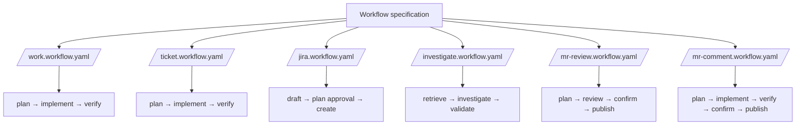

# Local workflow specification

This directory defines the local workflow specification in `agent/workflows/`.
The YAML specifications compose stage prompts in `agent/workflows/steps/`.

`/jira` accepts one readable Markdown-file path or a quick Story breakdown. Its
`draft` stage creates no Jira records. Its Plannotator-gated `plan` stage
validates project metadata, required fields, and dependency links through
Atlassian MCP. Approval authorizes only `create` to make the reviewed Epic and
Stories and re-read them for verification.

